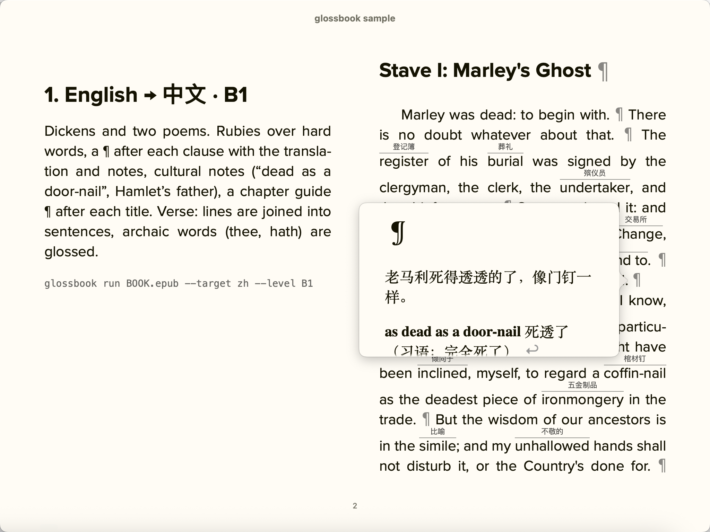
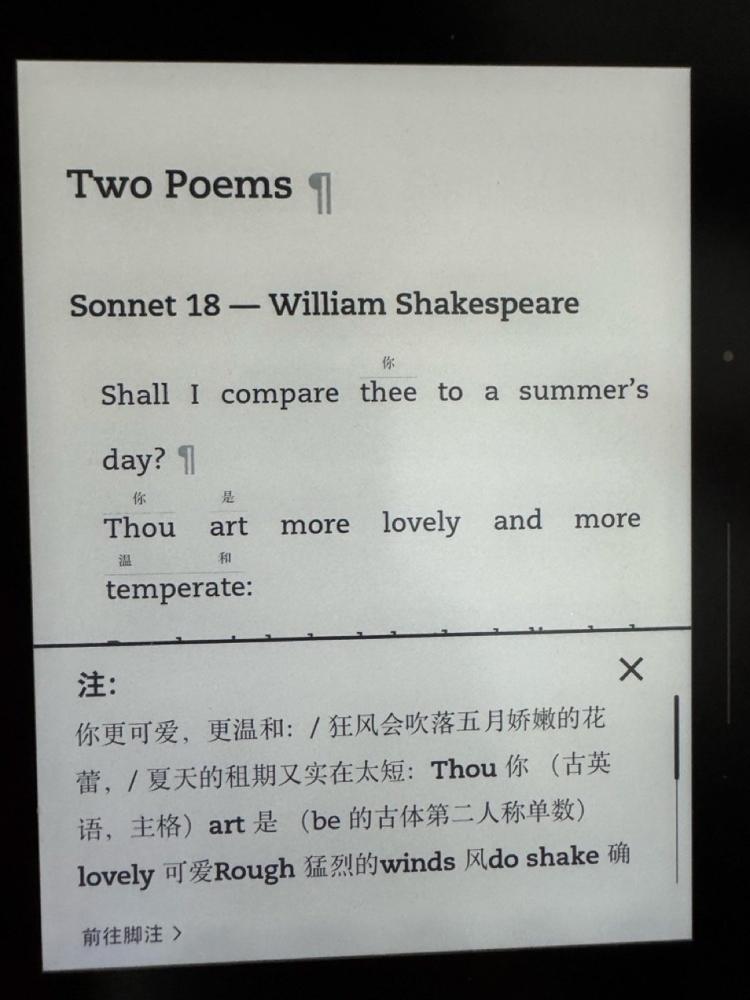
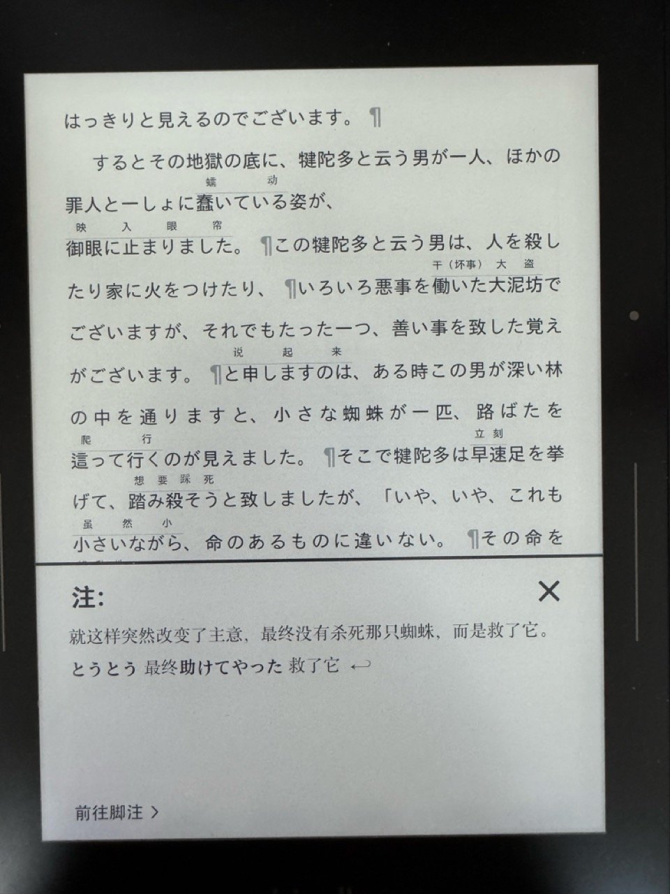
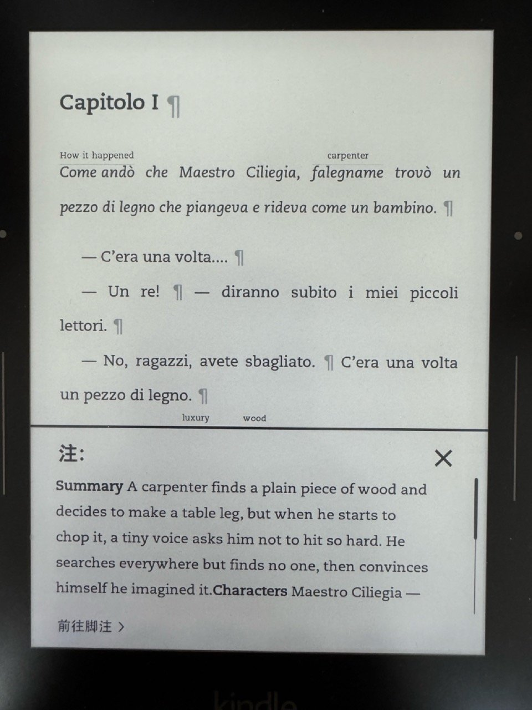
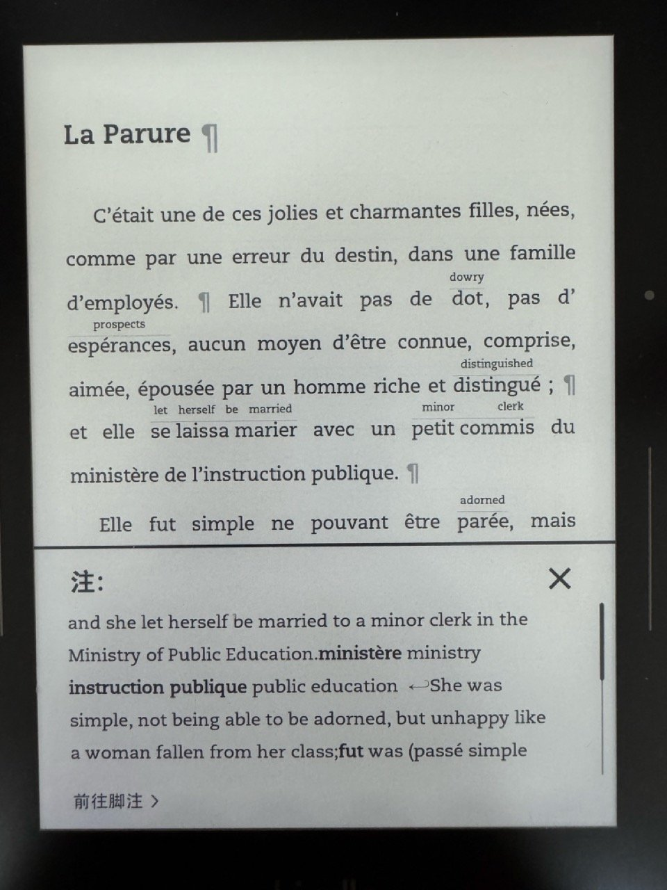
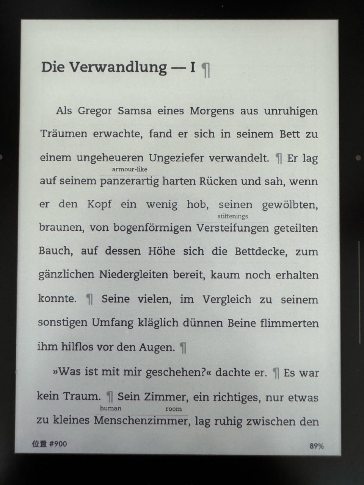
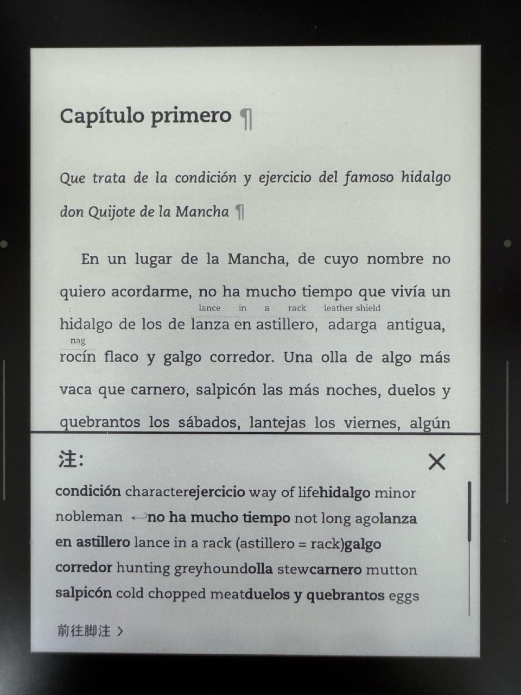

# glossbook

把外语原版 EPUB 做成学习者注释版，在 Kindle 或其他阅读器上直接读原文。

- **ruby 小字释义**：难词上方印一个按上下文的短释义，按你的 CEFR 级别和密度筛选；同一个词最多出现 N 次
- **¶ 弹注**：每个分句或句子后一个 ¶，点开看译文、难词说明（不规则变位的原形、习语、俚语、语体），以及可选的文化/典故注释
- **章首导读**：章标题后一个 ¶，写不剧透的大意、主要人物、关键词
- 人名、地名不翻译

输出是普通 EPUB3（弹出式脚注＋`<ruby>`），真机 Kindle、Kindle Previewer 和 epubcheck 都验证过。[English](README.md)

## 截图

[示例](#示例)在 Kindle 和 Apple Books 上的效果。

<p><br><sub>Apple Books：分隔页，以及在正文上打开的一条 ¶ 注释</sub></p>

<table>
<tr><td width="25%" valign="top"><br><sub>英语 → 中文，B1：难词上方有 ruby 释义；点 ¶ 看译文和词语说明</sub></td><td width="25%" valign="top"><br><sub>十四行诗第 18 首：诗行合成整句；古语 thou、art 有注</sub></td><td width="25%" valign="top"><br><sub>日语 → 中文：芥川龙之介，日文上方的 ruby 释义</sub></td><td width="25%" valign="top"><br><sub>意大利语 → 英语，A2：标题后的 ¶ 打开章首导读</sub></td></tr>
<tr><td width="25%" valign="top"><br><sub>法语 → 英语，B1：长句拆成分句</sub></td><td width="25%" valign="top"><br><sub>德语 → 英语，B2：每句一个 ¶，ruby 较少</sub></td><td width="25%" valign="top"><br><sub>西班牙语 → 英语，C1，<code>--no-translation</code>：只有注释</sub></td></tr>
</table>

## 示例

`samples/` 用六段简短的公版原文做一本演示用的 EPUB：每段用不同的语言和设置注释（DeepSeek v4-pro），再合成一本书，每部分前有一页分隔页：

| 部分 | 原文 | 设置 | 看点 |
|---|---|---|---|
| 英语 → 中文 | 狄更斯《圣诞颂歌》开头；莎士比亚十四行诗第 18 首；弗罗斯特《未选择的路》 | `--target zh --level B1` | ruby 释义、每个分句一个 ¶、章首导读；诗行合成整句，thee、hath 等古语有注 |
| 日语 → 中文 | 芥川龙之介《蜘蛛丝》 | `--target zh --level B1` | 日语断句，敬语形式和佛教词语的说明 |
| 意大利语 → 英语 | 科洛迪《木偶奇遇记》第 1 章 | `--target en --level A2` | 分句短，ruby 密 |
| 法语 → 英语 | 莫泊桑《项链》开头 | `--target en --level B1` | 长句拆成分句 |
| 德语 → 英语 | 卡夫卡《变形记》开头 | `--target en --level B2` | 每句一个 ¶，ruby 较少 |
| 西班牙语 → 英语 | 塞万提斯《堂吉诃德》第 1 章开头 | `--target en --level C1 --no-translation` | 不给译文，只注难词和古旧词 |

合计约 3000 词，生成费用约 0.08 美元。自己生成：

```
samples/fetch_sources.sh    # 从古登堡计划、维基文库、青空文库下载原文 → samples/src/
samples/build_sample.sh     # 六本源书 → glossbook run（ds4pro）→ samples/glossbook-sample.epub
```

`make_sources.py` 把源书写到 `samples/books/`（各书的注释版也在这里，可以单独读）；`merge.py` 把注释版合成一本。

## 安装

需要 Python 3.11 以上。还没发布到 PyPI，从 GitHub 安装（推荐用 [pipx](https://pipx.pypa.io/)，装完在任何目录都能用 `glossbook` 命令）：

```
pipx install git+https://github.com/xiebingqiang/glossbook
glossbook init --target zh    # 生成 ~/.config/glossbook/.env（放 API key）和 config.toml（默认设置）
```

把 API key 填进 `~/.config/glossbook/.env`，再用 `glossbook models` 检查（列出模型、key 是否已配置、价格）。`glossbook init --here` 则在当前目录生成 `./.env` 和 `./glossbook.toml`，在这个目录运行时优先于全局配置。也可以直接用环境变量。

开发：`git clone …` 后执行 `pip install -e ".[dev]"`。

## 选择模型

支持任何 OpenAI 兼容接口。模型定义在 `glossbook/models.toml`：

| 名称 | 模型 | key | 说明 |
|---|---|---|---|
| `ds4pro`（默认） | DeepSeek V4 Pro 官方接口 | `DEEPSEEK_API_KEY`，在 [platform.deepseek.com](https://platform.deepseek.com) 申请 | 测试最充分；关推理 |
| `ds4flash` | DeepSeek Flash 官方接口 | 同上 | 费用约三分之一；译文接近，难词注释少一些，偶有错释 |
| `ds4pro-or` | 经 OpenRouter 调用 DeepSeek V4 Pro | `OPENROUTER_API_KEY` | 一个 key 可用多家模型 |
| `gemini` | Gemini 2.5 Flash | `GEMINI_API_KEY` | 可用 |
| `gpt`、`claude` | GPT-5 mini、Claude Sonnet 5 | `OPENAI_API_KEY`、`ANTHROPIC_API_KEY` | 示例，未实测 |

用 `--model`、设置文件里的 `model = "…"` 或环境变量 `GLOSSBOOK_MODEL` 选择模型。费用一律以美元计，`models.toml` 里是每百万 token 的价格（DeepSeek 的人民币价按 7.1 换算）。要加模型或改价格，把这个文件复制到 `~/.config/glossbook/models.toml` 或 `./models.toml` 再改。每个模型还可以设置 `temperature = false`（不传温度）和 `max_tokens_param = "max_completion_tokens"`，gpt-5 这类推理模型需要这两项。

## 用法

```
glossbook inspect book.epub                          # 章节编号、字数、粗估费用
glossbook preview book.epub --target zh --level B1   # 跑一小段 → preview.html ＋费用估算
glossbook run book.epub --chapters 3-8               # 沿用预览的设置；花钱前会先确认
glossbook build book.epub --level B2 --density low   # 只用缓存重新出书，不调用模型
glossbook report book.epub                           # token 用量和费用
```

`preview` 生成一个 HTML 页面，可以在页面上切换级别和密度看效果，确认后再为整本书花钱（页面默认英文，`--ui zh` 显示中文）。你给的设置会按书记住，所以 `run` 不用再写一遍参数就和预览一致（预览那一段直接用缓存）；另给的参数会覆盖记住的设置。`run` 开始前显示估算费用并询问；在脚本里运行要加 `--yes`。`--max-cost 2` 表示花到 2 美元就停。

每个请求的结果都缓存在 epub 旁边的 `<书名>.glossbook/` 里：中断（Ctrl-C、网络错误、余额不足）后再跑会接着做；用 `build` 改级别、密度、重复次数不花钱。输出文件写在原书旁边，名为 `书名.<目标语言>-<级别>.epub`（可用 `-o` 指定）。

## 在 Kindle 或其他阅读器上读

- **Kindle**：用 [Send to Kindle](https://www.amazon.com/sendtokindle)（网页、桌面程序或邮件）发送输出的 EPUB，亚马逊会自动转换。ruby 释义和 ¶ 弹注在真机上都能用。
- **Kobo、Apple Books、KOReader 等**：直接打开 EPUB。
- **手里是 AZW3/MOBI**：先用 [Calibre](https://calibre-ebook.com) 等工具转成 EPUB（仅限无 DRM 的书）。

## 设置

级别预设一次带出一组设置，你单独给的参数优先。优先级：内置默认 < 级别预设 < 设置文件（`./glossbook.toml`，没有则用 `~/.config/glossbook/config.toml`，`[settings]` 节）< 这本书记住的设置 < 命令行。

| 级别 | 多少句一个 ¶ | 分句最多词数 | ruby 密度（每 N 词一个） |
|---|---|---|---|
| A1 / A2 | 分句 | 15 / 20 | 7 / 9 |
| B1（默认） | 分句 | 25 | 12 |
| B2 | 1 句 | 35 | 20 |
| C1 | 2 句 | 50 | 35 |
| C2 | 3 句 | 60 | 60 |

一个 ¶ 不会跨段落：句子只在同一段内合并。例外是诗歌：很多 EPUB 里诗是一行一个段落，连续的诗行会被当作一段文字处理，所以一个 ¶ 对应诗里的一句（高级别是 2–3 句），而不是一行。

| 参数 | 含义 |
|---|---|
| `--target` | 译文和释义的语言（默认 `en`） |
| `--source` | 原文语言（默认读 EPUB） |
| `--level` | 读者 CEFR 级别 `A1`–`C2` |
| `--per-note` | `clause`（长句按标点拆分句）、`1`、`2`、`3`、`para` |
| `--density` | `low`、`normal`、`high` 或每多少词一个 ruby |
| `--repeat` | 同一个词最多上几次 ruby（默认 3） |
| `--culture` / `--no-culture` | 文化、典故注释 |
| `--intro` / `--no-intro` | 章首导读 |
| `--translation` / `--no-translation` | ¶ 里的译文（关掉只留难词和文化注释，费用约少 20%；`build --no-translation` 可直接隐藏已生成的译文） |
| `--model` | `models.toml` 里的模型名 |
| `--jobs` | 并发请求数（默认 8） |
| `--max-cost` | 费用（美元）到这个数就停 |
| `--chunk-words` | 每个请求约多少词（默认 300） |

支持：EPUB 输入；空格分词的语言、中文、日文（作为原文或目标语言都可以）。不支持：从右往左的语言、带 DRM 的文件。

能处理的版式：小说散文、诗歌（一行一段，或用 `<br/>` 断行）、剧本、带脚注编号的书（`<sup>[1]</sup>`、粘在词后的数字）和纸书页码标记（`<span class="origpage">[12]</span>`、`epub:type="pagebreak"`），这些都不会发给模型、诗节和章节编号（不注释）、双语书（另一种文字的段落会跳过）。`dc:language` 缺失或标错（很多转换工具一律写 `en`）时会根据正文识别并替换，同时给出提示；`--source` 始终优先。目录只有一项时改为按文件分章。

## 费用

`ds4pro` 实测（2026 年 9 月）：

- 意大利语 → 中文，B1：含章首导读约 0.025 美元 / 千词（8.7 万词的小说约 2.1 美元）
- 英语 → 中文，B2：约 0.01 美元 / 千词
- 拉丁语 → 中文，B1：约 0.04 美元 / 千词（几乎每个词都有释义，每百词 30–40 个，附格和词形说明）

基本能读、只想要一点点注释的书，用 `--level C2 --no-translation --no-intro`：每百词只注约 3 个生僻、文学或古旧的词。*Pride and Prejudice* 实测费用不到 B1 默认的一半（全书约 0.83 美元对 1.75 美元）；模型仍要读完每一句，输入 token 是下限。

用 `ds4flash`，同一本意大利语小说估算约 0.6 美元（约三成）。

省 token 的做法：断句由代码完成，模型不用回抄原文；用紧凑的行格式代替 JSON；system 提示词固定，吃服务端前缀缓存（先单发一个请求热缓存）；只重试缺失的分句；关推理。

## 开发

```
python3 -m pytest -q
ruff check
```

测试里的 EPUB 都是现场生成的，模型用假客户端，不需要联网。

## 版权

只处理你有权处理的书。注释版包含完整原文和译文，不要传播受版权保护的书的注释版。带 DRM 的文件会被拒绝。

## 许可证

[GNU Affero 通用公共许可证 v3.0 或更高版本](LICENSE)。如果把修改过的版本作为网络服务提供，需要向服务的用户提供源代码。
